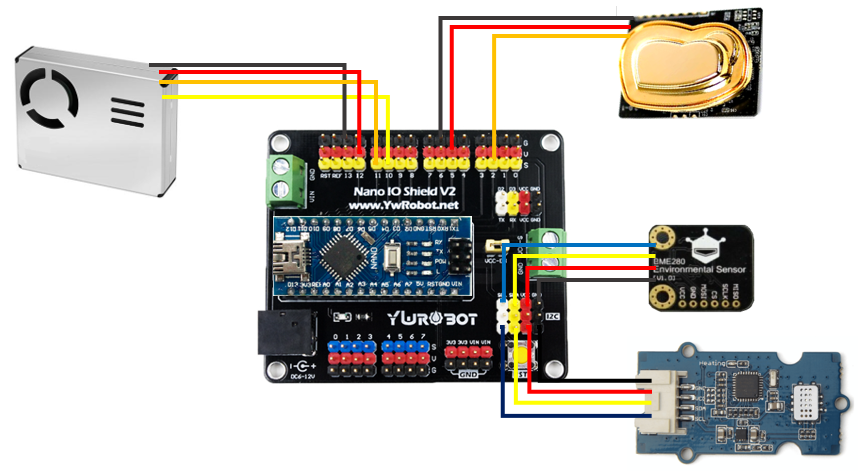
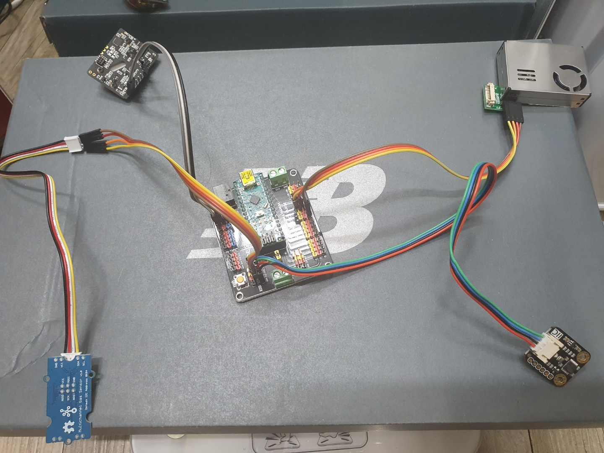
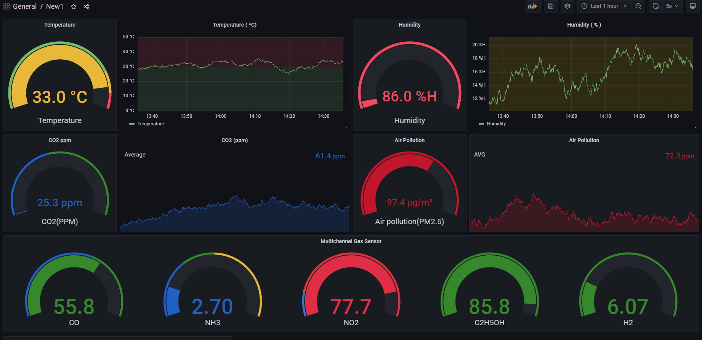

# Air-Quality-KMU
- Support GatoLab


**개요**
raspberry - arduino를 활용하여 IOT환경에서 실내 공기질 센서 데이터를 측정, 수집, 관리한다.
prometheus - grafana를 연동하여 데이터를 시각화하여 실시간 모니터링 또한 가능하게 한다.
autostart를 활용하여 실행에 편의성을 부여한다.

---

### 1. 조원
```
PL  박준용
github : https://github.com/jyporse
```
```
양성민
github : https://github.com/ysmin709
```
```
이승준
github : https://github.com/ls-jun
```
---

### 2. 센서모듈
- Multichannel Gas Sensor (가스 센서)
- PMS7003m    (미세먼지 센서)
- BME280     (온습도 센서)
- TG100     (co2 센서)

---

### 3. 사용 스택
   
 

---

### 4. 회로도



---

### 5. 실행모습


---
